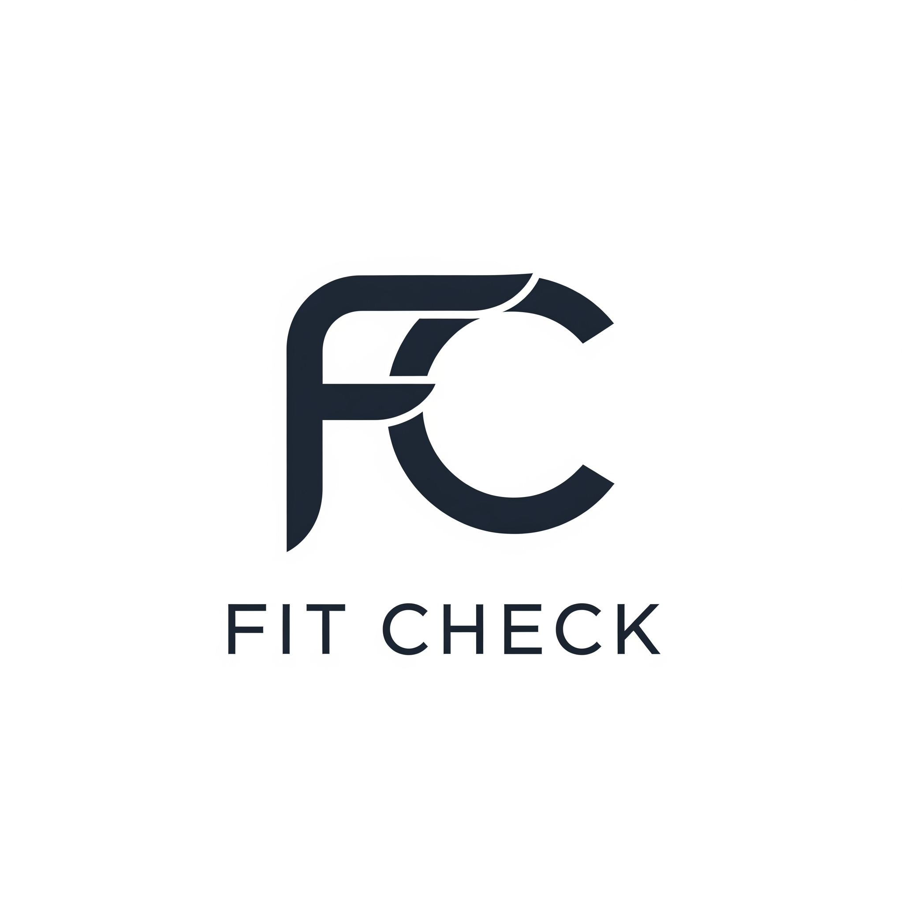

# FitCheck: The Smart Outfit Planner



FitCheck is a web application designed to help you manage your daily outfits with a focus on smart, connected devices. This project combines a modern React frontend with a Firebase backend to provide user authentication, real-time data, and a seamless experience for planning your wardrobe. The long-term goal is to integrate with a custom **ESP32-based IoT clothing rack** to create a truly interactive experience.

## ✨ Features

* **User Authentication:** Secure sign-up and login using Firebase Authentication.

* **Personalized Dashboard:** A central hub for all your data, customized for each user.

* **Real-time Weather:** Integration with a weather API to help you plan outfits based on current conditions.

* **Calendar Integration:** Connect your Google Calendar to see upcoming events and plan outfits accordingly.

* **IoT Device Integration:** A dedicated section to check the connection status of your smart clothing rack.

* **Responsive Design:** Built with Tailwind CSS and DaisyUI to ensure a beautiful and consistent experience on all devices.

## 🚀 Technology Stack

* **Frontend:**

    * **React:** For building a dynamic and component-based user interface.

    * **Vite:** A fast build tool for a lean development experience.

    * **Tailwind CSS & DaisyUI:** A utility-first CSS framework and a component library for rapid styling.

* **Backend & Services:**

    * **Firebase Authentication:** A secure, managed service for user sign-up and login.

    * **Weather API:** (e.g., OpenWeatherMap, WeatherAPI) for fetching real-time weather data.

    * **Google Calendar API:** For connecting to and displaying a user's calendar events.

    * **Serverless Functions:** To securely handle API calls to third-party services.

    * **MQTT Broker:** A messaging service for communication between the app and the IoT device.

    * **ESP32:** The microcontroller platform for the physical IoT clothing rack.

## ⚙️ Installation and Setup

### Prerequisites

* Node.js (v18 or higher)

* npm

* A Firebase project with Email/Password authentication enabled.

### Steps

1.  **Clone the repository:**

    ```
    git clone [https://github.com/your-username/your-repo-name.git](https://github.com/your-username/your-repo-name.git)
    cd your-repo-name
    ```

2.  **Install dependencies:**

    ```
    npm install
    ```

3.  **Set up environment variables:**
    Create a `.env` file in the root directory and add your Firebase configuration and API keys.

    ```
    VITE_FIREBASE_API_KEY="your_api_key_here"
    VITE_FIREBASE_AUTH_DOMAIN="your_auth_domain_here"
    VITE_FIREBASE_PROJECT_ID="your_project_id_here"
    # ... and so on for other keys
    ```

4.  **Run the application:**

    ```
    npm run dev
    ```

    The app will be running at `http://localhost:5173`.

## 🤝 Contributing

Contributions are welcome! If you have suggestions or find a bug, please open an issue or submit a pull request
